# GitHub Branch Protection with SonarQube Quality Gate

This guide explains how to set up GitHub branch protection rules that block merging PRs if:
1. Tests fail (`./gradlew test`)
2. Code coverage is below 80%
3. SonarQube quality gate fails

## Prerequisites

- ✅ GitHub repository with branch protection enabled
- ✅ SonarCloud account (free for public repos)
- ✅ SonarQube project configured
- ✅ GitHub Actions enabled

## Step 1: Create GitHub Actions Workflow

Create `.github/workflows/pr-checks.yml`:

```yaml
name: PR Quality Checks

on:
  pull_request:
    branches: [ main, develop ]
  push:
    branches: [ main, develop ]

jobs:
  test-and-coverage:
    name: Run Tests & Coverage
    runs-on: ubuntu-latest
    
    steps:
      - name: Checkout code
        uses: actions/checkout@v4
        with:
          fetch-depth: 0  # Shallow clones should be disabled for SonarQube

      - name: Set up JDK 17
        uses: actions/setup-java@v4
        with:
          java-version: '17'
          distribution: 'temurin'
          cache: gradle

      - name: Grant execute permission for gradlew
        run: chmod +x gradlew

      - name: Run unit tests
        run: ./gradlew test --no-daemon --stacktrace

      - name: Generate JaCoCo coverage report
        run: ./gradlew jacocoTestReport --no-daemon

      - name: Upload test results
        if: always()
        uses: actions/upload-artifact@v4
        with:
          name: test-results
          path: |
            app/build/reports/tests/
            app/build/test-results/

      - name: Upload coverage reports
        if: always()
        uses: actions/upload-artifact@v4
        with:
          name: coverage-reports
          path: |
            app/build/reports/jacoco/

      - name: Check coverage threshold
        run: |
          # This will fail the job if coverage is below threshold
          # The actual threshold check is done by SonarQube
          echo "Coverage check will be validated by SonarQube"

  sonarqube-analysis:
    name: SonarQube Analysis
    runs-on: ubuntu-latest
    needs: test-and-coverage  # Only run if tests pass
    
    steps:
      - name: Checkout code
        uses: actions/checkout@v4
        with:
          fetch-depth: 0  # Required for SonarQube

      - name: Set up JDK 17
        uses: actions/setup-java@v4
        with:
          java-version: '17'
          distribution: 'temurin'
          cache: gradle

      - name: Grant execute permission for gradlew
        run: chmod +x gradlew

      - name: Run tests and generate coverage
        run: |
          ./gradlew test jacocoTestReport --no-daemon

      - name: SonarQube Scan
        env:
          SONAR_TOKEN: ${{ secrets.SONAR_TOKEN }}
          GITHUB_TOKEN: ${{ secrets.GITHUB_TOKEN }}
        run: |
          ./gradlew sonar \
            -Dsonar.projectKey=${{ secrets.SONAR_PROJECT_KEY }} \
            -Dsonar.organization=${{ secrets.SONAR_ORGANIZATION }} \
            -Dsonar.host.url=https://sonarcloud.io \
            -Dsonar.token=${{ secrets.SONAR_TOKEN }} \
            -Dsonar.qualitygate.wait=true \
            --no-daemon

      - name: Check SonarQube Quality Gate
        uses: sonarsource/sonarqube-quality-gate-action@master
        timeout-minutes: 5
        env:
          SONAR_TOKEN: ${{ secrets.SONAR_TOKEN }}

  # Optional: Add build job
  build:
    name: Build APK
    runs-on: ubuntu-latest
    needs: test-and-coverage
    
    steps:
      - name: Checkout code
        uses: actions/checkout@v4

      - name: Set up JDK 17
        uses: actions/setup-java@v4
        with:
          java-version: '17'
          distribution: 'temurin'
          cache: gradle

      - name: Grant execute permission for gradlew
        run: chmod +x gradlew

      - name: Build Debug APK
        run: ./gradlew assembleDebug --no-daemon

      - name: Upload APK
        uses: actions/upload-artifact@v4
        with:
          name: debug-apk
          path: app/build/outputs/apk/debug/*.apk
```

## Step 2: Configure SonarQube Quality Gate

### Update `sonar-project.properties`:

```properties
sonar.projectKey=kyrylokk_android-cicd-testing
sonar.organization=kyrylokk

# Project info
sonar.projectName=Android CI/CD Testing Sample
sonar.projectVersion=1.0

# Sources and tests
sonar.sources=app/src/main/java,app/src/main/kotlin
sonar.tests=app/src/test/java,app/src/test/kotlin

# Java binaries
sonar.java.binaries=app/build/tmp/kotlin-classes/debug
sonar.java.test.binaries=app/build/tmp/kotlin-classes/debugUnitTest

# Coverage
sonar.coverage.jacoco.xmlReportPaths=app/build/reports/jacoco/jacocoTestReport/jacocoTestReport.xml

# Code coverage thresholds - CRITICAL FOR BLOCKING PRs
sonar.coverage.overall=80.0
sonar.coverage.new=80.0

# Quality gate - MUST wait for quality gate result
sonar.qualitygate.wait=true
sonar.newCode.referenceBranch=main

# Pull request decoration (for GitHub integration)
sonar.pullrequest.provider=github
sonar.pullrequest.github.repository=kyrylokk/android-cicd-testing

# Exclusions (as configured earlier)
sonar.exclusions=\
  **/R.java,\
  **/BuildConfig.java,\
  **/*.xml,\
  **/res/**,\
  **/AndroidManifest.xml,\
  **/build/**,\
  **/generated/**

sonar.coverage.exclusions=\
  **/*Test*.kt,\
  **/*Test*.java,\
  **/*Activity.kt,\
  **/*ActivityKt.class,\
  **/*Fragment.kt,\
  **/R.java,\
  **/BuildConfig.java,\
  **/ui/theme/**,\
  **/ui/navigation/**,\
  **/*Screen.kt,\
  **/*ScreenKt.class,\
  **/*ScreenKt$*.class,\
  **/ComposableSingletons$*.class,\
  **/di/**,\
  **/App.class,\
  **/Application.kt,\
  **/MainActivity.kt,\
  **/build/**,\
  **/generated/**,\
  **/*Hilt*.java,\
  **/*Hilt*.kt,\
  **/*_Factory.java,\
  **/*_MembersInjector.java,\
  **/*Module.kt,\
  **/*Module.java

sonar.test.exclusions=**/test/**,**/androidTest/**

# Android specific
sonar.android.lint.report=app/build/reports/lint-results.xml
```

## Step 3: Set Up GitHub Secrets

Go to your GitHub repository → Settings → Secrets and variables → Actions

Add these secrets:

1. **SONAR_TOKEN**
   - Go to SonarCloud → My Account → Security → Generate Token
   - Copy the token
   - Add as GitHub secret

2. **SONAR_PROJECT_KEY** (if different from sonar-project.properties)
   - Value: `kyrylokk_android-cicd-testing`

3. **SONAR_ORGANIZATION**
   - Value: `kyrylokk`

## Step 4: Configure SonarCloud Quality Gate

1. Go to [SonarCloud](https://sonarcloud.io)
2. Select your project
3. Go to **Quality Gates**
4. Create or edit quality gate with these conditions:

### Recommended Quality Gate Conditions:

| Metric | Operator | Value |
|--------|----------|-------|
| Coverage on New Code | is less than | 80% |
| Coverage | is less than | 80% |
| Duplicated Lines (%) on New Code | is greater than | 3% |
| Maintainability Rating on New Code | is worse than | A |
| Reliability Rating on New Code | is worse than | A |
| Security Rating on New Code | is worse than | A |
| Security Hotspots Reviewed on New Code | is less than | 100% |

## Step 5: Configure GitHub Branch Protection Rules

Go to: **Repository Settings → Branches → Branch protection rules**

### For `main` branch:

1. ✅ **Require a pull request before merging**
   - ✅ Require approvals: 1
   - ✅ Dismiss stale pull request approvals when new commits are pushed
   - ✅ Require review from Code Owners (optional)

2. ✅ **Require status checks to pass before merging**
   - ✅ Require branches to be up to date before merging
   - **Add these required status checks:**
     - `test-and-coverage` (from GitHub Actions)
     - `sonarqube-analysis` (from GitHub Actions)
     - `SonarCloud Code Analysis` (from SonarCloud app)
     - `build` (optional, for APK build check)

3. ✅ **Require conversation resolution before merging**

4. ✅ **Require signed commits** (optional, recommended)

5. ✅ **Require linear history** (optional)

6. ✅ **Do not allow bypassing the above settings**
   - Uncheck "Allow specified actors to bypass required pull requests"

7. ✅ **Restrict who can push to matching branches** (optional)

## Step 6: Install SonarCloud GitHub App

1. Go to [SonarCloud GitHub App](https://github.com/apps/sonarcloud)
2. Click "Install"
3. Select your repository
4. Authorize the app

This enables:
- ✅ Pull request decoration (comments on PRs)
- ✅ Quality gate status checks
- ✅ Coverage reports in PR

## Step 7: Test the Setup

### Create a test PR with failing tests:

```bash
# Create a new branch
git checkout -b test-branch

# Make a change that breaks a test or reduces coverage
# For example, add a new method without tests

git add .
git commit -m "Test PR checks"
git push origin test-branch
```

### Create a PR and verify:

1. ✅ GitHub Actions runs automatically
2. ✅ Tests execute
3. ✅ Coverage report generates
4. ✅ SonarQube analysis runs
5. ✅ Quality gate check runs
6. ✅ PR is blocked if any check fails

## How It Works

```mermaid
graph TD
    A[Developer creates PR] --> B[GitHub Actions triggered]
    B --> C{Run Tests}
    C -->|Fail| D[❌ PR Blocked - Tests Failed]
    C -->|Pass| E[Generate Coverage Report]
    E --> F[Run SonarQube Analysis]
    F --> G{Quality Gate Check}
    G -->|Coverage < 80%| H[❌ PR Blocked - Coverage Too Low]
    G -->|Other issues| I[❌ PR Blocked - Quality Gate Failed]
    G -->|Pass| J[✅ All Checks Pass]
    J --> K[PR Ready to Merge]
    D --> L[Fix Issues]
    H --> L
    I --> L
    L --> B
```



## Verification Steps

1. **Check workflow runs:**
   ```bash
   # Go to: Repository → Actions
   # Verify all jobs run successfully
   ```

2. **Check SonarCloud project:**
   ```bash
   # Go to: https://sonarcloud.io/dashboard?id=kyrylokk_android-cicd-testing
   # Verify coverage is displayed correctly
   ```

3. **Verify PR decoration:**
   - SonarCloud should comment on PRs with quality gate status
   - Coverage metrics should be visible
   - Issues should be highlighted

## Troubleshooting

### If tests don't fail the PR:

- Check that `test-and-coverage` is in required status checks
- Verify the job fails when tests fail (check exit code)

### If coverage doesn't fail the PR:

- Ensure `sonar.qualitygate.wait=true` in sonar-project.properties
- Verify quality gate has coverage condition set
- Check that `sonarqube-analysis` job is required

### If SonarCloud doesn't comment on PRs:

- Install/reinstall SonarCloud GitHub App
- Check app permissions
- Verify webhook is configured

## Local Testing

Test locally before pushing:

```bash
# Run tests
./gradlew test

# Generate coverage
./gradlew jacocoTestReport

# Run SonarQube analysis (requires SONAR_TOKEN)
export SONAR_TOKEN=your_token_here
./gradlew sonar -Dsonar.qualitygate.wait=true
```

## Benefits

✅ **No bad code gets merged**
- Tests must pass
- Coverage must be ≥80%
- Quality gate must pass

✅ **Automatic enforcement**
- No manual oversight needed
- Can't bypass without admin rights

✅ **Clear feedback**
- Developers see exactly what failed
- SonarCloud comments show issues

✅ **Continuous quality**
- Every PR is checked
- Technical debt stays controlled

## Next Steps

1. Create the workflow file
2. Add GitHub secrets
3. Configure branch protection
4. Test with a PR
5. Adjust quality gate as needed

---

**Your PRs are now protected! 🛡️**

